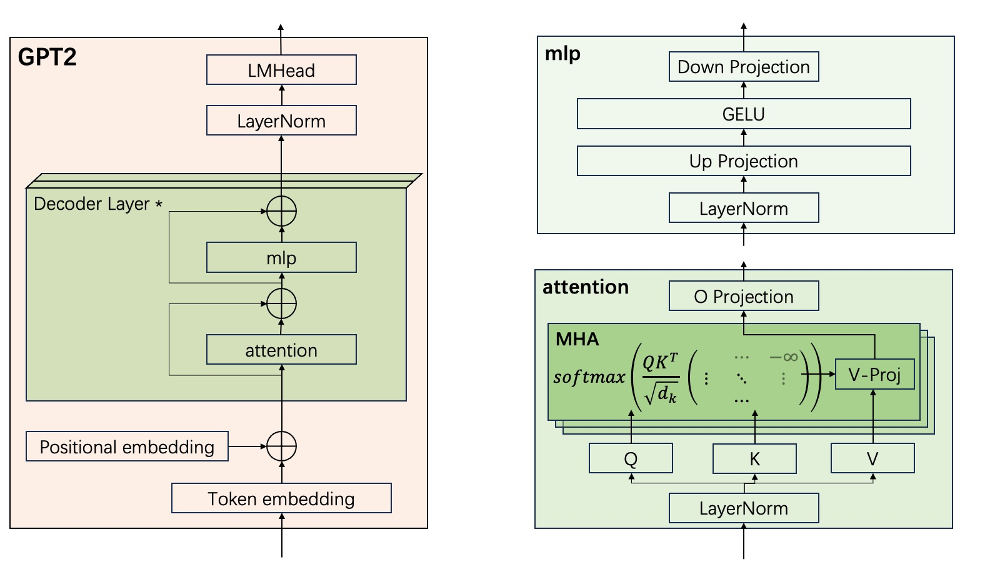

代码面前，了无秘密。只有重写一遍，才能更清楚里面的细节。

代码: [https://github.com/solofox/gpt2](https://github.com/solofox/gpt2), branch: **v1**。

# GPT2 模型

GPT2 是 OpenAI 在 2019 年开源的大语言模型，它是一个典型的 decoder-only 结构的模型。如果用今天的视角看，GPT2 的能力当然很初级（比如很容易胡说八道，逻辑能力弱），但是它是一个承上启下，具有里程碑意义的模型，它是 LLM 从“**实验室玩具**”走向“**工业界基础设施**”的关键催化剂：
- **伟大的试金石**：它证明了 transformer 可以处理长文本。
- **商业化的破局者**：巨头们彻底醒悟，随后引发了持续到现在的算力军备竞赛。
- **极佳的工程教材**：依然是学习 LLM 底层原理的范本，它足够简单，有足够完整。

GPT2 官方一共发布了4个尺寸的模型，gpt2-small / gpt2-medium / gpt2-large / gpt2-xl，这些**都是 pretrained 模型**，没有 instruction 模型。另外，不像后来的模型系列，超大杯模型会采用 MoE 架构，其它中小杯模型会采用 dense 架构。在 GPT2 这里，没有这样的区别，除了超参数不同，这几个模型的网络结构都完全一致。

## 参考

**技术报告**: [https://cdn.openai.com/research-covers/language-unsupervised/language_understanding_paper.pdf](https://cdn.openai.com/research-covers/language-unsupervised/language_understanding_paper.pdf)

**参考代码**: [https://github.com/openai/gpt-2.git](https://github.com/openai/gpt-2.git). 代码是基于 tensorflow1 写的，如果要在本机上运行，需要 **python3.6** 及以下的版本。

**参数**:

| 变种 | d_model | 上下文窗口 | 层数 | 头数 | 参数总量|
|-----|---------|-----------|-----|------|-------|
| small | 768 | 1024 | 12 | 12 | | 
| medium | 1024 | 1024 | 24 | 16 | | 
| large | 1280 | 1024 | 36 | 20 | |
| xl | 1600 | 1024 | 48 | 25 | | 

共同点是：下文窗口都是 1024， d_k 都是 64

## 模型结构

关于模型结构，在技术报告中是如下这么写的，第一第二句就说了：对不起，你要回去看 transformer 和我们的 GPT1 的设计。

> We use a Transformer (Vaswani et al., 2017) based architecture for our LMs. The model largely follows the details
> of the OpenAI GPT model (Radford et al., 2018) with a few modifications. Layer normalization (Ba et al., 2016)
> was moved to the input of each sub-block, similar to a
> pre-activation residual network (He et al., 2016) and an
> additional layer normalization was added after the final selfattention block. A modified initialization which accounts
> for the accumulation on the residual path with model depth
> is used. We scale the weights of residual layers at initialization by a factor of 1/√N where N is the number of
> residual layers. The vocabulary is expanded to 50,257. We
> also increase the context size from 512 to 1024 tokens and
> a larger batchsize of 512 is used.

结合 GPT1 的技术报告里面的段落：

> Model specifications Our model largely follows the original transformer work [62]. We trained a
> 12-layer decoder-only transformer with masked self-attention heads (768 dimensional states and 12
> attention heads). For the position-wise feed-forward networks, we used 3072 dimensional inner states.
> We used the Adam optimization scheme [27] with a max learning rate of 2.5e-4. The learning rate
> was increased linearly from zero over the first 2000 updates and annealed to 0 using a cosine schedule.
> We train for 100 epochs on minibatches of 64 randomly sampled, contiguous sequences of 512 tokens.
> Since layernorm [2] is used extensively throughout the model, a simple weight initialization of
> N(0, 0.02) was sufficient. We used a bytepair encoding (BPE) vocabulary with 40,000 merges [53]
> and residual, embedding, and attention dropouts with a rate of 0.1 for regularization. We also
> employed a modified version of L2 regularization proposed in [37], with w = 0.01 on all non bias or
> gain weights. For the activation function, we used the Gaussian Error Linear Unit (GELU) [18]. We
> used learned position embeddings instead of the sinusoidal version proposed in the original work.
> We use the ftfy library
> to clean the raw text in BooksCorpus, standardize some punctuation and
> whitespace, and use the spaCy tokenizer.

大概可以勾勒出来，GPT1 是这样的：
- 模型结构大部分跟 《Attention Is All You Need》 中的 transformer 一致。
- 位置向量 PE 是模型学习的，而不是原始论文中的正弦位置向量。
- 基础参数：L = 12, d_model = 768, h = 12, d_ff = 3072。
- 正则化函数使用 layernorm。
- 激活函数使用 GELU。
- tokenizer 使用 BPE 编码。

GPT2 是这样的：
- layernorm 从每个子层的后面移到了前面。原因没有解释。
- 在最后一个 attention block 之后，加了一个 layernorm。
- 词汇表大小 V = 50257；上下文长度扩展一倍为 1024。

大体上，这个模型结构画出来时这样的：




# 代码

只要熟悉 pytorch 中模型的写法，它的代码并不比 MNIST 的代码复杂太多，只是有一些操作在图像处理中遇到较少，写法不太熟悉。

这里总结一下写的过程中一些花了点时间的地方。

## safetensors 文件格式

safetensors 文件格式挺简单的，文件头是一个json文件描述了里面的 tensors，所以加载 safetensors 文件的大部分代码都很容易。唯一的问题在于怎么把存储的浮点数数组转成 torch.tensor，使用 `torch.frombuffer` 这个API：

```python
# utils.py:_load_tensor
tensor = torch.frombuffer(bytearray(buffer), dtype=dtype).reshape(shape)
```

相反，如果要把某个 tensor 存储为 bytearray，可以用 `tensor.numpy().tobytes()`：
```python
if not tensor.is_contiguous():
    tensor = tensor.contiguous()
bytes = tensor.numpy().tobytes()
```

## Embedding 查找

**inputs**: input_ids，形状是 [B, N] (B=batch_size, N=seq_len)

**embeding**: wte，形状是 [V, d_model] (V=vocab_size); 或者 wpe, 形状是 [L, d_model] (L=max_context_window)

**诉求**: 把 input_ids 里面的每一个元素变成它所对应的 embeddding 向量，输出形状是 [B, N, d_model]。

用 tensor 作为索引，这个语法之前不是太理解，其实写法挺简单的:

```python
wte[input_ids]

wpe[input_ids]
```

这是 pytorch 中的高级索引语法，以后专门写篇小文章介绍。

## Attention 

一开始写 Attention 我是老老实实写的：

```
def attention(self, x: torch.Tensor) -> torch.Tensor:
    seq_len = x.shape[-2]

    x = F.layer_norm(x, normalized_shape=(self.d_model,), weight=self.ln_1_weight, bias=self.ln_1_bias, eps=self.layernorm_eps)

    scale = torch.rsqrt(torch.tensor([self.d_model / self.h], dtype=x.dtype, device=x.device))

    qkv_merged = torch.matmul(x, self.attn_weight) + self.attn_bias
    qkv_splited = torch.split(qkv_merged, self.d_model // self.h, dim=-1)
    assert len(qkv_splited) == 3 * self.h

    q_splited = qkv_splited[ : self.h]
    k_splited = qkv_splited[self.h : 2 * self.h]
    v_splited = qkv_splited[2 * self.h : ]

    heads = []
    for i in range(self.h):
        qk_similarities = torch.matmul(q_splited[i], k_splited[i].transpose(-2, -1)) * scale
        qk_similarities += self.causal_bias[:seq_len, :seq_len]
        qk_similarities = F.softmax(qk_similarities, dim=-1)
        headi = torch.matmul(qk_similarities, v_splited[i])
        heads.append(headi)
    x = torch.concat(heads, dim=-1)
    x = torch.matmul(x, self.attn_proj_weight) + self.attn_proj_bias
    return x
```

GPT2 中，QKV 映射的矩阵是合并成一个大矩阵的，形状为 [d_model, 3 * d_model]：
- [ d_model, 0 : d_model] 是 Q 的映射矩阵
- [ d_model, d_model : 2 * d_model ] 是 K 的映射矩阵
- [ d_model, 2 * d_model : 3 * d_model ] 是 V 的映射矩阵

而且 GPT2 中 d_k = d_q = d_v = d_model / h，所以上述操作的过程是：
1. x = x * W_QKV + B_QkV，得到 [B, N, 3 * d_model] 的矩阵
2. 把 x 的最后一维按照 d_k 进行切分，得到 List[ [B, N, d_k] ]，这是一个**list**，一共有 **3*h** 个元素。这里就得到了注意力头上的每一个 Tensor
3. [ q_0, q_1, ..., q_{h_1}, k_0, k_1, ..., k_{h-1}, v_0, v_1, ..., v_{h-1} ]
4. 接下来就是一个循环，拿出 q_i, k_i, v_i，进行 attention 的计算：softmax(causal_mask((q_i @ k_i.T / sqrt(d_k)))) @ v_i
5. 再合并

看这里的困难在3步和第4步不匹配，第4步的操作数并不连续，如果我们能把第三步的数据变成如下的格式：

[ q_0, k_0, v_0, q_1, k_1, v_1, ..., q_{h_1}, k_{h-1}, v_{h-1} ]

后来从 GPT-2 的官方代码看来的写法，去掉了循环，全部都是矩阵操作：

```python
def attention(self, x: torch.Tensor) -> torch.Tensor:
    seq_len = x.shape[-2]

    x = layer_norm(x, weight=self.ln_1_weight, bias=self.ln_1_bias, eps=self.layernorm_eps)
    qkv_merged = torch.matmul(x, self.attn_weight) + self.attn_bias

    scale = torch.rsqrt(torch.tensor([self.d_model / self.h], dtype=x.dtype, device=x.device))

    # split q, k, v
    q, k, v = qkv_merged.split(self.d_model, dim=-1)
    q = q.reshape((-1, seq_len, self.h, self.d_model // self.h))
    q = q.transpose(-2, -3)
    k = k.reshape((-1, seq_len, self.h, self.d_model // self.h))
    k = k.transpose(-2, -3)
    v = v.reshape((-1, seq_len, self.h, self.d_model // self.h))
    v = v.transpose(-2, -3)

    scores = torch.matmul(q, k.transpose(-2, -1)) * scale
    # causal mask
    scores += self.causal_bias[:seq_len, :seq_len]
    scores = F.softmax(scores, dim=-1)
    scores = torch.matmul(scores, v)
    # merges back
    x = scores.transpose(-2, -3)
    x = x.reshape((-1, seq_len, self.d_model))

    x = torch.matmul(x, self.attn_proj_weight) + self.attn_proj_bias
    return x
```

1. Q/K/V: [B, N, d_model]
2. 按照注意力头将词向量拆分：[B, N, h, d_k]。这个时候不同的头是交叉的
3. 交换N和h的维度：[B, h, N, d_k]。这样操作同一个注意力头所有词的词向量构成了矩阵，所有词是维度N，词向量是维度d_k。
4. 按照单注意力头的方式计算attention。
5. 合并，跟步骤3、步骤2的逆操作。

# 心得

整体的细节还是挺多的，最后我还是对着官方的 tensorflow1 的代码看了一下，才最终把代码给跑顺了。

## 矩阵结构牢记心中

在每一步，都注释好各个操作数的矩阵结构：一共有多少维，每个维度的大小是多少。

调试时，经常遇到 shape 不对的异常，时时把 shape 打印出来。

对于很多的 API 操作，要经常看看文档，它操作的是哪一维，维度是否合并/分裂，对 **dim** / **keepdim** 两个参数保持敏锐。

看公式/论文时，对于实现和数学上的向量区别保持敏锐，也就是说到底是用**行向量**还是**列向量**？在代码实现中，都是用行向量，
所以代码的写法都是 **x*W**；但是在数学上，大部分用的是列向量，写法都是 **W*x**。

即使是行向量写法，W 用的是原始矩阵，还是转置矩阵？在 GPT2 中，W 用的是原始矩阵，它的维度跟数学上的维度是一致的: **[in_features, out_features]**。但是在 pytorch 的 Module 中，一般采用的 **[out_features, in_features]**。这一点同样需要保持敏锐。

## 调试

调试这个模型，我的做法很直接，就是把它和官方的做对比：
1. 在每一个操作后面，把操作的结果写入文件系统，保存为 safetensor 格式
2. 写一个工具，分别读入我的 safetensor 结果，和官方的 safetensor 结果
3. 通过 2 分的方式缩小范围，定位到哪个具体的操作有问题
4. 通过 google 搜索一下具体这个操作的原理
5. 如果还搞不定，看一下官方的实现

# Stay curious

从现在的视角来看，这个模型傻傻的。

它不太聪明。这几个模型我问它："Which city is the capital of France"，他们都没有回答出来。

```bash
harry$ python ./main.py ./models.cache/gpt2-small/ "Which city is the capital of France"
?

Some people think they have a lot in common. They both inherited the country from the French Revolution, so they won't be as happy about their own future as their French counterparts.

What about the rest of France? How does France's economy plan to cope with a 20% growth rate next year?

France has been experiencing a steady decline in its exports. It's not about to stop, as the IMF and European Central Bank have recently said. In fact, this is a political decision which many believe will be made by France's leaders. The political leaders of the European Union are going to be much stronger.
```

它听不懂人类的指令。它喜欢写故事，不管你输入是啥，它都把它当做故事的开头，不停地给你续写。这就是 pretained 模型和 instruction 模型的差别。

```bash
harry$ python ./main.py ./models.cache/gpt2-small/ "Say you love me once and stop immediately"
, cuz I'm not gonna stop you."

But then she turns to him, and he says, "Well, I just gave you a couple of dollars. I've got a few more."

"You're not taking that," he says, "I'm just giving you a couple dollars, when you've got all these resources and you've just got to be willing to let me say something, you know?"

So she says, "I know you love me, but I just want to know, what are you going to do?"

"I'm not doing anything," he says, and she says, "I'm just starting to make my financial situation better."

"Yeah, that's fine," she says.

"How about you give me some $10,000?"

"Well, I'll give you a^C
Aborted!
```

贪婪采样很容易就陷入了死循环

```bash
harry$ python ./main.py ./models.cache/gpt2-small/ "Do you love me?" -k 1
 I love you. I love you. I love you. I love you. I love you. I love you. I love you. I love you. I love you. I love you. I love you. I love you. I love you. I love you. I love you. I love you. I love you. I love you. I love you. I love you. I love you. I love you. I love you. I love you. I love you. I love you. I love you. I love you. I love you. I love you. I love you. I love you. I love you. I love you. I love you. I love you. I love you. I love you. I love you. I love you. I love you. I love you. I love you. I love you. I love you^C
Aborted!
```


